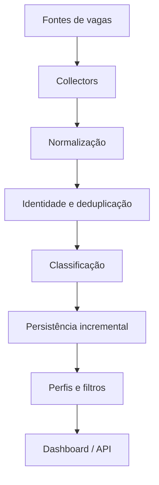
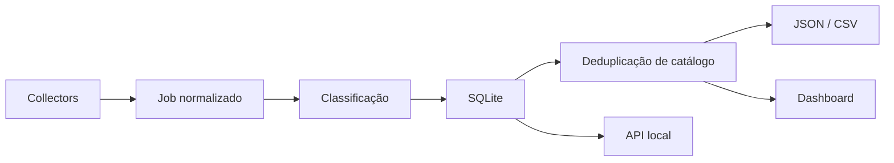
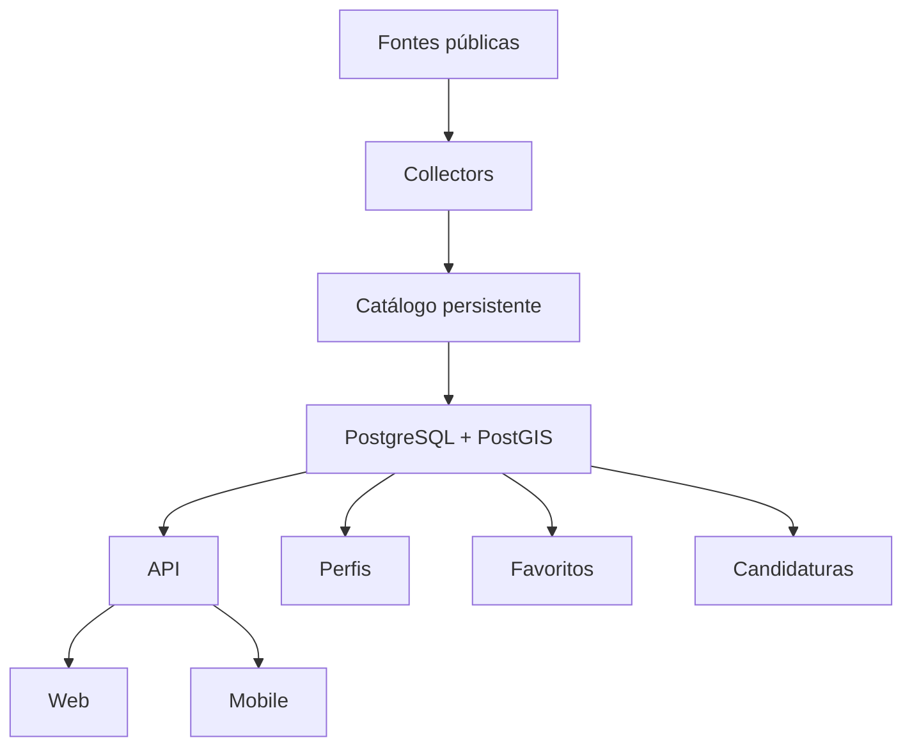

# 🎯 Opportunity Radar

O **Opportunity Radar** é um agregador inteligente de oportunidades de início de carreira.

A proposta é reunir vagas publicadas em diferentes plataformas, normalizar os dados, classificar cada oportunidade por **curso/área** e **tipo de vaga**, acompanhar o ciclo de vida dos anúncios e permitir que diferentes perfis encontrem o que faz sentido para eles sem limitar a coleta na origem.

> **Estado atual:** Checkpoint 4 concluído — persistência relacional unificada e sincronização segura do estado do servidor validadas.
> **Próximo passo:** Checkpoint 5 — PostgreSQL / Supabase / PostGIS.

---

## Por que este projeto existe?

Vagas de estágio, trainee, júnior, pesquisa e programas universitários ficam espalhadas entre dezenas de plataformas e páginas corporativas.

Além disso:

- empresas publicam a mesma oportunidade em lugares diferentes;
- títulos de vaga nem sempre deixam claro quais cursos são aceitos;
- alguns portais removem vagas sem indicar explicitamente que foram encerradas;
- buscas por palavras-chave podem esconder oportunidades relevantes;
- cada plataforma usa formatos, identificadores e estruturas diferentes.

O Opportunity Radar tenta resolver isso criando **um catálogo único e pesquisável**, sem depender de um único portal.

---

## A proposta

O princípio central é simples:

> **Collect first, filter later.**

Os coletores tentam formar uma base ampla de oportunidades.
Curso, localização, intenção e perfil do usuário só entram **depois da coleta**.

Fluxo geral:



Uma vaga é coletada uma vez e pode ser relevante para vários cursos ao mesmo tempo.

Exemplo:

```text
Hardware Intern

Engenharia Elétrica       92%
Engenharia de Computação  88%
Ciência da Computação     61%
Engenharia Mecânica       17%
```

---

## Princípios do projeto

### 1. Collect first, filter later

Perfis não controlam o que os collectors coletam.

Isso evita perder uma oportunidade apenas porque o perfil ativo naquele momento não incluía determinado curso, cidade ou tipo de vaga.

### 2. Identidade por fonte

A identidade primária de um anúncio é:

```text
(source, source_job_id)
```

Duas fontes diferentes não são tratadas como a mesma vaga sem evidência suficiente.

### 3. Deduplicação conservadora

Quando anúncios parecem representar a mesma oportunidade, o catálogo pode consolidá-los.

Mas, quando há dúvida, o sistema prefere manter duas entradas a esconder uma vaga legítima.

### 4. Lifecycle conservador

Uma vaga não é considerada encerrada só porque deixou de aparecer em uma execução parcial.

O ciclo atual é:

```text
active
  ↓  1ª ausência em varredura completa
missing
  ↓  2ª ausência consecutiva em varredura completa
inactive
```

Se a vaga reaparecer:

```text
inactive / missing → active
```

### 5. Automação reprodutível

Execuções locais são rápidas e incrementais.

O GitHub Actions executa auditorias mais pesadas, persiste o SQLite entre runs e mantém snapshots temporários para recuperação.

---

## O que o Opportunity Radar já faz

| Área | Estado |
|---|---|
| Coleta multi-fonte | ✅ |
| Normalização de vagas | ✅ |
| Classificação por curso | ✅ |
| Classificação por tipo de oportunidade | ✅ |
| Deduplicação conservadora | ✅ |
| Geocodificação aproximada por cidade | ✅ |
| Busca por distância | ✅ |
| Perfis de busca | ✅ |
| Dashboard local | ✅ |
| Busca regional sob demanda | ✅ |
| Persistência incremental em SQLite | ✅ |
| Lifecycle active / missing / inactive | ✅ |
| Auditoria diária no GitHub Actions | ✅ |
| Persistência relacional unificada | ✅ |
| PostgreSQL / Supabase / PostGIS | ⏳ |
| Usuários e perfis persistentes | ⏳ |
| Favoritos e candidaturas | ⏳ |
| Aplicativo mobile | ⏳ |

---

## Fontes

O projeto usa apenas integrações públicas ou configuráveis e mantém cada integração isolada em seu próprio collector.

### ATS e portais corporativos

Entre as integrações existentes estão:

- Gupy;
- Lever;
- Greenhouse;
- Ashby;
- SuccessFactors / SAP Career Site Builder;
- Workday;
- SmartRecruiters;
- Eightfold;
- InHire;
- IziRH;
- TOTVS Atração de Talentos;
- Teamtailor.

Há também boards e páginas corporativas específicas, como o catálogo universitário da Cargill.

### Fontes brasileiras de início de carreira

Atualmente há collectors ativos para:

- Vagas.com;
- 99jobs;
- WallJobs;
- Companhia de Estágios;
- Nube;
- IEL Carreiras;
- Super Estágios;
- TAQE;
- Bettha;
- Matchbox Brasil.

Algumas integrações podem ficar desabilitadas quando o portal não oferece uma rota pública suficientemente estável.

---

## Cursos e áreas

O sistema não foi projetado para um único curso.

Entre os cursos já modelados estão:

- Engenharia Elétrica;
- Engenharia Mecânica;
- Engenharia Civil;
- Engenharia de Produção;
- Engenharia Química;
- Engenharia de Materiais;
- Engenharia de Computação;
- Engenharia Física;
- Engenharia Agronômica;
- Engenharia Ambiental;
- Engenharia de Alimentos;
- Engenharia Florestal;
- Ciência da Computação;
- Ciência de Dados;
- Administração.

Os catálogos ficam em:

```text
config/catalogs.py
```

Adicionar um curso novo deve ser principalmente uma alteração de configuração e regras de afinidade — não a criação de um novo collector.

---

## Tipos de oportunidade

O radar reconhece diferentes intenções, incluindo:

- estágio;
- programa de estágio;
- summer internship;
- estágio de férias / verão;
- co-op;
- trainee / graduate program;
- júnior / entry level;
- aprendiz / jovem aprendiz;
- pesquisa / iniciação científica;
- oportunidades sazonais.

---

## Perfis de busca

Perfis são presets de filtro e matching.

Eles ficam em:

```text
config/profiles.py
```

Exemplos atuais incluem:

- Engenharia Elétrica — Estágio no Brasil;
- Ciência da Computação — Estágio no Brasil;
- Engenharia Química — Estágio no Brasil;
- Engenharias UFSCar — Estágio no Brasil;
- perfis internacionais para summer internship / co-op.

Um perfil pode combinar:

- um ou mais cursos;
- tipos de oportunidade;
- palavras incluídas ou excluídas;
- modalidade de trabalho;
- países;
- cidade de referência;
- distância máxima;
- score mínimo.

Perfis **não limitam a coleta**.

---

## Arquitetura atual



Hoje o SQLite mantém:

- anúncios coletados;
- hashes para processamento incremental;
- timestamps de primeira e última visualização;
- lifecycle;
- memória de discovery;
- estado das auditorias por source/scope.

O **Checkpoint 4** reorganiza essa persistência para separar explicitamente a oportunidade consolidada dos anúncios de origem.

---

## Modos de execução

### Execução local normal

```powershell
python main.py
```

Modo incremental e mais rápido.

Reutiliza IDs e detalhes conhecidos sempre que possível.

### Descoberta completa

```powershell
$env:FULL_DISCOVERY="1"
python main.py
```

Desabilita early-stops de discovery para reconstruir uma visão completa dos escopos configurados.

### Full refresh

```powershell
$env:FULL_REFRESH="1"
python main.py
```

Além da descoberta completa, força atualização de detalhes conhecidos.

É o modo mais pesado e deve ser usado principalmente para rebuild/debug.

### Auditoria diária

O GitHub Actions roda automaticamente com:

```text
DAILY_AUDIT=1
UNBOUNDED_COLLECTION=1
```

Nesse modo:

- restaura o SQLite do run anterior;
- percorre os escopos configurados sem early-stop;
- mantém guard rails técnicos contra paginação quebrada;
- reconcilia lifecycle apenas quando a cobertura pode ser provada como completa;
- salva o SQLite atualizado somente após sucesso;
- publica snapshots temporários como artifacts.

---

## Como rodar localmente

### Windows / PowerShell

```powershell
python -m venv .venv
.\.venv\Scripts\Activate.ps1
pip install -r requirements.txt

python main.py
python server.py
```

Depois abra:

```text
http://localhost:8000
```

O `main.py` atualiza a base.

O `server.py` inicia a API/dashboard local e habilita a busca regional sob demanda.

---

## Dashboard e localização

O dashboard permite filtrar por:

- perfil;
- curso;
- intenção;
- fonte;
- modalidade;
- score mínimo;
- distância;
- texto livre.

A geolocalização das vagas é aproximada pelo centro da cidade.

Ela é suficiente para filtros como:

```text
25 km
50 km
100 km
250 km
```

Não representa distância porta a porta nem tempo de deslocamento.

A busca regional ao vivo usa cidades próximas como consultas externas. Coordenadas exatas não precisam ser enviadas às fontes de vagas.

---

## Persistência incremental

O armazenamento atual fica em:

```text
data/opportunity_radar.db
```

O arquivo é local e não é versionado.

O sistema mantém:

- `jobs`;
- `discovery_state`;
- `collection_scopes`.

Execuções incompletas ou com erro não podem, por si só, inativar vagas.

Mais detalhes:

- [`docs/checkpoint-3.md`](docs/checkpoint-3.md)

---

## Arquivos gerados

A execução gera:

```text
output/
├── jobs.json
├── jobs.csv
├── profiles.json
├── matches.json
├── search_links.json
├── stats.json
├── dashboard_data.json
└── index.html
```

Esses arquivos são derivados da base e **não são versionados no Git**.

No GitHub Actions eles são publicados como artifacts temporários.

---

## Estrutura do repositório

```text
opportunity-radar/
├── api/                  # API FastAPI e busca regional
├── collectors/           # integrações com fontes de vagas
├── config/               # fontes, cursos, intenções e perfis
├── database/             # desenho do schema PostgreSQL futuro
├── docs/                 # documentação dos checkpoints
├── models/               # modelos de domínio
├── processing/           # classificação, localização e deduplicação
├── storage/              # persistência incremental
├── tests/                # testes automatizados
├── tools/                # utilitários de manutenção
├── output/               # artefatos gerados localmente
├── main.py               # pipeline principal
└── server.py             # servidor local
```

---

## Testes e validação

Suite principal:

```powershell
python -m pytest -q
```

Regressões estruturais:

```powershell
python check_project.py
```

Há também smoke tests específicos para fontes e checkpoints.

Exemplos:

```powershell
python validate_checkpoint3_sources.py
python validate_checkpoint31_sources.py
```

Smoke tests acessam fontes reais e, portanto, podem falhar temporariamente por timeout, rate limit ou indisponibilidade externa sem indicar uma regressão interna.

---

## Roadmap

| Etapa | Objetivo | Estado |
|---|---|---|
| CP1 | Consistência do pipeline | ✅ |
| CP2 | Identidade, deduplicação e expansão de fontes | ✅ |
| CP3 | Integridade incremental e lifecycle | ✅ |
| CP3.1 | Engenharias + expansão brasileira | ✅ |
| CP4 | Persistência unificada | ✅ |
| CP5 | PostgreSQL / Supabase / PostGIS | ⏳ |
| CP6 | API de catálogo | ⏳ |
| CP7 | Usuários e perfis persistentes | ⏳ |
| CP8 | Favoritos e candidaturas | ⏳ |
| CP9 | Experiência web definitiva | ⏳ |
| CP10 | Aplicativo Expo / mobile | ⏳ |

Roadmap detalhado:

- [`docs/roadmap.md`](docs/roadmap.md)

---

## Checkpoint atual

O Checkpoint 4 foi concluído e estabilizou o modelo relacional do catálogo.

O próximo trabalho arquitetural é:

### Checkpoint 5 — PostgreSQL / Supabase / PostGIS

Objetivos principais:

- portar o modelo estabilizado de `opportunities` e `source_postings` para PostgreSQL;
- preservar identidade, lifecycle, course scores, intents e associações cross-source;
- introduzir PostGIS para consultas geográficas;
- reduzir gradualmente a dependência do SQLite local sem reformular o domínio.

Referências:

- [`docs/checkpoint-4.md`](docs/checkpoint-4.md)
- [`docs/roadmap.md`](docs/roadmap.md)

---

## Limitações conhecidas

O Opportunity Radar não pretende garantir literalmente todas as vagas existentes na internet.

A cobertura depende de:

- disponibilidade pública das fontes;
- estabilidade dos endpoints;
- paginação;
- qualidade dos dados publicados;
- limites técnicos e rate limits externos.

Algumas fontes possuem APIs estruturadas; outras dependem de HTML público e exigem parsers defensivos.

Matching por curso é uma estimativa baseada em sinais textuais e estruturados — não substitui a leitura dos requisitos oficiais da vaga.

---

## Documentação técnica

- [Roadmap](docs/roadmap.md)
- [Checkpoint 3 — Incremental integrity](docs/checkpoint-3.md)
- [Checkpoint 4 — Persistência unificada](docs/checkpoint-4.md)
- [Checkpoint 2.7 — ATS adicionais](docs/checkpoint-2.7.md)
- [Checkpoint 2.9 — Fontes brasileiras](docs/checkpoint-2.9.md)
- [Fechamento do bloco 2.x](docs/checkpoint-2x-finalization.md)

---

## Visão de produto

A arquitetura de longo prazo é:



A ideia é que o Opportunity Radar deixe de ser apenas um script de agregação e evolua para uma plataforma pessoal de descoberta e acompanhamento de oportunidades.
